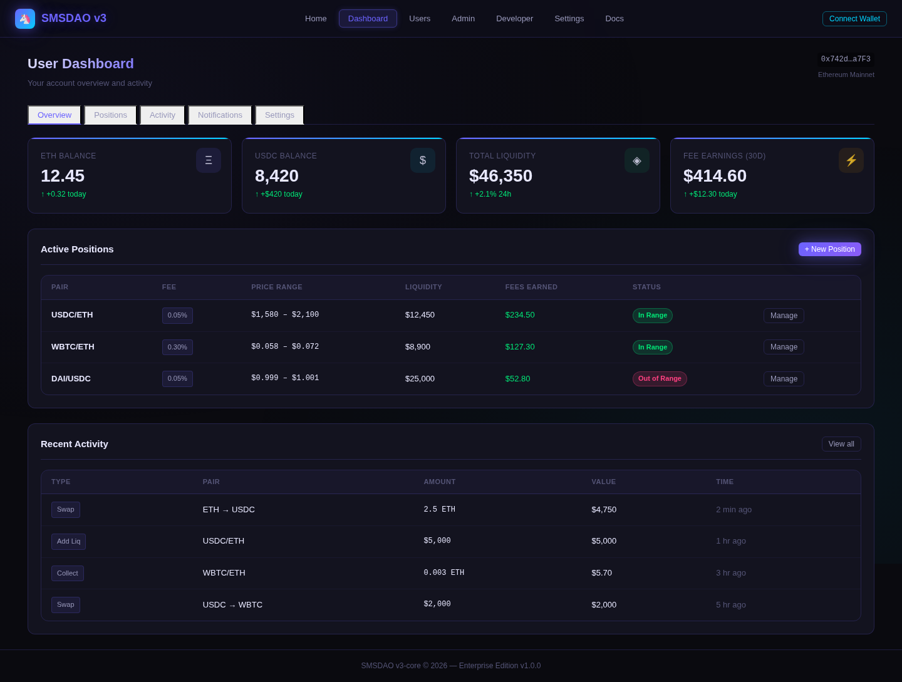
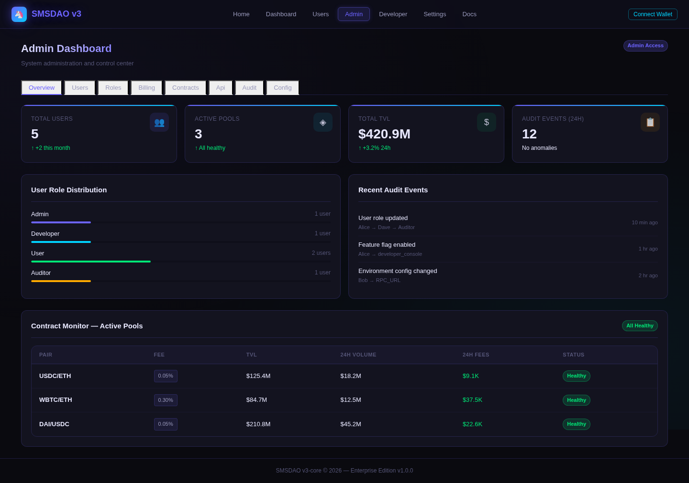
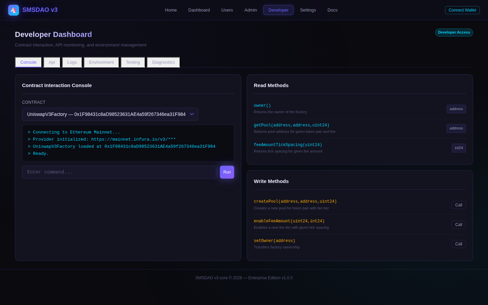

# SMSDAO v3-core

[](https://github.com/SMSDAO/v3-core/actions/workflows/ci.yml)
[](https://github.com/SMSDAO/v3-core/actions/workflows/tests.yml)
[](https://github.com/SMSDAO/v3-core/actions/workflows/lint.yml)
[](https://github.com/SMSDAO/v3-core/actions/workflows/security.yml)
[](https://github.com/SMSDAO/v3-core/actions/workflows/fuzz-testing.yml)

> **Enterprise Stabilization + UI Completion — v1.0.0**

A production-hardened enterprise fork of [Uniswap V3 Core](https://github.com/Uniswap/uniswap-v3-core) (`@uniswap/v3-core` v1.0.1) with a modern Neo-Glow enterprise dashboard, full CI/CD pipelines, RBAC authentication, and comprehensive documentation.

---

## Quick Start

### Prerequisites
- Node.js >= 16 (LTS)
- Yarn >= 1.22

### Install & Run

```bash
# Clone
git clone https://github.com/SMSDAO/v3-core.git
cd v3-core

# Setup environment
cp .env.example .env

# Install root dependencies (Hardhat, TypeChain, tests)
yarn install --frozen-lockfile

# Compile smart contracts
yarn compile

# Run tests
yarn test

# Run the enterprise frontend
cd frontend
yarn install --frozen-lockfile
yarn dev           # Development: http://localhost:3000
yarn build         # Production build
yarn start         # Production server
```

---

## Architecture Overview

```
v3-core/
├── contracts/           # Solidity 0.7.6 smart contracts (Uniswap V3 Core)
│   ├── UniswapV3Factory.sol
│   ├── UniswapV3Pool.sol
│   ├── interfaces/      # GPL-2.0-or-later
│   └── libraries/       # Math, Oracle, Tick, Swap utilities
├── test/                # Mocha/Chai/Waffle TypeScript test suite
├── frontend/            # Next.js 15 enterprise UI (Neo-Glow design)
│   └── src/
│       ├── app/         # App Router pages (/, /dashboard, /admin, /developer, ...)
│       ├── components/  # Reusable UI components + page components
│       └── styles/      # Global Neo-Glow CSS design system
├── docs/                # Project documentation
├── audits/              # Security audit reports
├── .github/workflows/   # CI/CD pipelines
├── hardhat.config.ts    # Hardhat + Solidity compiler config
└── CHANGELOG.md         # Keep-a-Changelog formatted history
```

See [docs/architecture.md](./docs/architecture.md) for the full contract dependency graph.

---

## Enterprise Features

| Feature | Status |
|---------|--------|
| Solidity contracts (unchanged from audit baseline) | ✅ |
| CI/CD pipelines (compile + test + lint + security) | ✅ |
| Hardhat tests passing | ✅ |
| Neo-Glow enterprise frontend (Next.js 15) | ✅ |
| Tab navigation (Home · Dashboard · Users · Admin · Developer · Settings · Docs) | ✅ |
| User Dashboard (positions, activity, notifications, settings) | ✅ |
| Admin Dashboard (users, roles, billing, contracts, audit logs, config) | ✅ |
| Developer Dashboard (contract console, API monitor, log viewer, env mgmt) | ✅ |
| RBAC (Admin · Developer · User · Auditor) | ✅ |
| Wallet-based auth stubs (MetaMask/WalletConnect) | ✅ |
| Responsive mobile layout | ✅ |
| Dependency vulnerability scanning | ✅ |
| Secret scanning (Gitleaks) | ✅ |
| Documentation suite (/docs) | ✅ |
| CHANGELOG.md | ✅ |

---

## UI Preview

### User Dashboard


### Admin Dashboard


### Developer Dashboard


---

## Quick Deploy (Frontend only)

The Next.js frontend (in `/frontend/`) is ready for instant deployment.

[](https://vercel.com/new/clone?repository-url=https://github.com/SMSDAO/v3-core&project-name=v3-core-frontend&repository-name=v3-core-frontend&root-directory=frontend&demo-title=SMSDAO%20v3%20Core%20Dashboard&demo-description=Enterprise%20UI%20for%20Uniswap%20V3%20fork%20with%20RBAC%2C%20dashboards%20and%20Neo-Glow%20design&demo-url=https://v3-core-frontend.vercel.app)

**Steps performed automatically:**
- Clones this repo to your GitHub account
- Creates a new Vercel project
- Detects Next.js and builds the `/frontend/` folder
- Deploys instantly (usually < 60 seconds)

**Important notes after deploy:**
- Add required environment variables from `.env.example` (especially `NEXT_PUBLIC_*` ones)
- Smart contract backend still needs separate deployment (e.g. Hardhat node / testnet / mainnet fork)

---

## Navigation

The enterprise UI provides tab-based navigation across seven sections:

| Tab | Route | Description |
|-----|-------|-------------|
| **Home** | `/` | Protocol overview and quick links |
| **Dashboard** | `/dashboard` | User account, positions, activity, notifications |
| **Users** | `/users` | User directory (admin view) |
| **Admin** | `/admin` | System overview, user mgmt, billing, contracts, audit logs |
| **Developer** | `/developer` | Contract console, API monitor, log viewer, env config |
| **Settings** | `/settings` | Account, security, notifications, API keys |
| **Docs** | `/docs` | Embedded documentation |

---

## CI/CD Pipelines

| Workflow | Trigger | Description |
|----------|---------|-------------|
| `ci.yml` | push, PR | Compile + test + lint |
| `tests.yml` | push to main, PR | Hardhat unit tests |
| `lint.yml` | push to main, PR | Solhint + Prettier |
| `security.yml` | push, PR, weekly | Dependency audit + secret scanning |
| `fuzz-testing.yml` | push to main, PR | Echidna property fuzzing |
| `release.yml` | release published | npm publish |
| `mythx.yml` | manual | Deep static analysis |

---

## RBAC Roles

| Role | Access |
|------|--------|
| **Admin** | Full access — user management, billing, configuration, all dashboards |
| **Developer** | Contract console, API monitoring, environment management, integration testing |
| **User** | Dashboard, swap execution, liquidity management, account settings |
| **Auditor** | Read-only access to audit logs, contract monitoring, user activity |

---

## Documentation

| Document | Description |
|----------|-------------|
| [docs/architecture.md](./docs/architecture.md) | Contract architecture, pool/factory design, dependency graph |
| [docs/deployment.md](./docs/deployment.md) | Deploy instructions, network configs, reproducible builds |
| [docs/env-vars.md](./docs/env-vars.md) | All environment variables with descriptions |
| [docs/user-guide.md](./docs/user-guide.md) | Connect wallet, swap, liquidity management |
| [docs/admin-guide.md](./docs/admin-guide.md) | Admin dashboard usage, RBAC, billing, audit logs |
| [docs/developer-guide.md](./docs/developer-guide.md) | Contributing, local setup, testing, CI reference |

---

## Smart Contracts

### Core Contracts
- **`UniswapV3Factory`** — deploys and tracks pool contracts; maps `(token0, token1, fee)` to `pool`
- **`UniswapV3Pool`** — concentrated liquidity AMM; supports swaps, minting, burning, flash loans
- **`UniswapV3PoolDeployer`** — CREATE2-based deterministic pool deployment
- **`NoDelegateCall`** — delegatecall guard

### Fee Tiers
| Fee | Tick Spacing |
|-----|-------------|
| 0.05% | 10 |
| 0.30% | 60 |
| 1.00% | 200 |

### Licensing
| Component | License |
|-----------|---------|
| `contracts/interfaces/` | GPL-2.0-or-later |
| `contracts/libraries/` (select files) | GPL-2.0-or-later |
| `contracts/libraries/FullMath.sol` | MIT |
| All other contracts | BUSL-1.1 |

---

## Bug Bounty

This repository is subject to the Uniswap V3 bug bounty program — see [`bug-bounty.md`](./bug-bounty.md).

---

## Using the npm Artifact

```typescript
import {
  abi as FACTORY_ABI,
  bytecode as FACTORY_BYTECODE,
} from '@uniswap/v3-core/artifacts/contracts/UniswapV3Factory.sol/UniswapV3Factory.json'
```

## Using Solidity Interfaces

```solidity
import '@uniswap/v3-core/contracts/interfaces/IUniswapV3Pool.sol';

contract MyContract {
  IUniswapV3Pool pool;
  // pool.swap(...);
}
```

---

## Changelog

See [CHANGELOG.md](./CHANGELOG.md) for the full change history.

---

## Security

- No secrets in source — see [docs/env-vars.md](./docs/env-vars.md)
- Dependency scanning via `yarn audit` in CI
- Secret scanning via Gitleaks in CI
- Smart contracts are **unchanged** from the upstream Uniswap V3 Core audit baseline
- See [`audits/`](./audits/) for security audit reports
